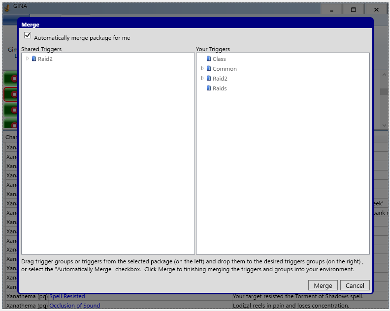
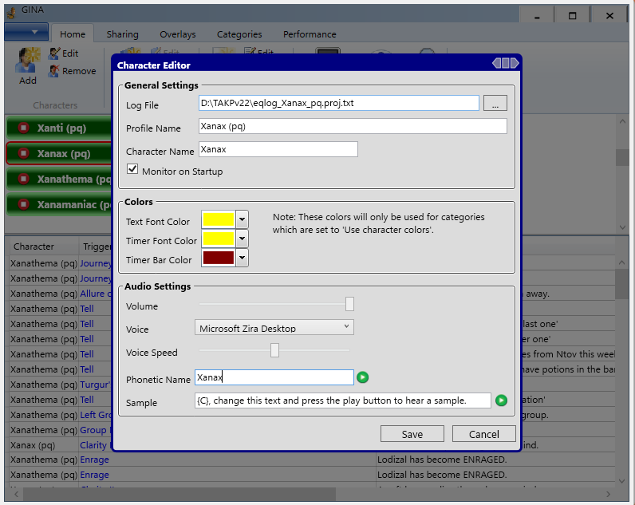
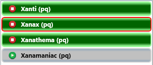
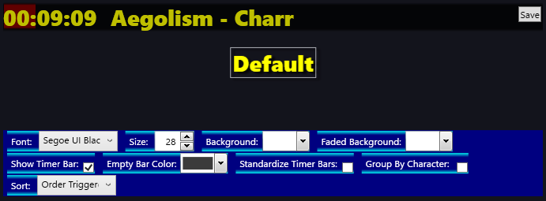
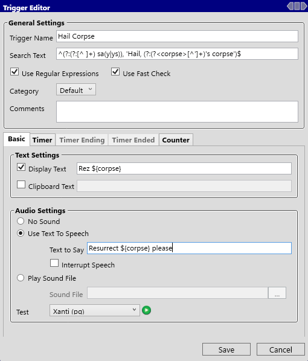

# GINA Setup Guide

GINA (Gamanern's Intelligent Notification Assistant) is a powerful log monitoring application designed primarily for EverQuest that provides audio and visual feedback based on customizable triggers. This guide will walk you through downloading, installing, and configuring GINA to enhance your EverQuest gameplay experience with automated alerts for raid mechanics, spell timers, and other critical game events.
## Download and Installation

## System Requirements

GINA requires [Microsoft .NET Framework 4.0](http://www.microsoft.com/en-us/download/details.aspx?id=17113) or higher to function properly. Windows XP users may need to manually download the framework, while newer operating systems typically have this installed by default. Some users report better compatibility with .NET Framework 4.5, particularly if installation issues occur.

## Direct Download Links

**Primary Download:** [Download GINA](https://eq.gimasoft.com/gina/Download.aspx)

**Beta Version:** [Download GINA Beta](https://eq.gimasoft.com/gina/DownloadBeta.aspx)

## Installation Steps

1. **Download the installer** from the primary download link above.
    
2. **Run setup.exe** - The installer will automatically prompt you to install .NET Framework 4.0 if needed.
    
3. **Handle Windows security warnings** - Modern Windows versions may display security warnings about the unsigned installer.
    
    - Right-click the downloaded file and select "Properties"
        
    - Check "Unblock" if available and click "Apply"
        
    - Choose "Run anyway" when prompted by Windows Defender
        
4. **Complete installation** - Follow the setup wizard prompts to finish installation
    

If you encounter installation issues on Windows 10/11, try running the installer from an administrator command prompt or temporarily disable Windows Defender during installation.

## Understanding GINA Triggers

Triggers in GINA define specific text patterns to monitor in your log files and the corresponding notifications to display when those patterns are detected. Each trigger consists of search text that matches log file entries and one or more notification types including audio alerts, visual overlays, text-to-speech announcements, and timer displays.

Triggers must be organized within trigger groups and cannot exist at the top level of your library. This organizational structure allows for easy management of class-specific triggers, raid-specific alerts, and general utility triggers. GINA supports four primary notification types: audio playback, text overlays, text-to-speech synthesis, and timer displays with countdown functionality.

## Fabio's GINA Triggers

**Primary Download:** [Download Fabio's GINA triggers](https://github.com/LordDemonos/FormerGlory/blob/master/gina_pack.gtp?raw=true)

## Importing Custom Triggers

To import trigger packages, you'll use GINA's sharing functionality located on the Sharing ribbon bar. The application supports multiple import formats including GINA package files, GamTextTriggers (.gtt) files, and direct imports from EverQuest's built-in trigger system.

**Import Process:**

1. **Open GINA** and navigate to the Sharing tab
    
2. **Click Import** and select **From GINA Package File**

3. **Browse to your trigger file** and select it
    
4. **Use the Merge screen** to organize imported triggers into appropriate groups

5. **Complete the merge** to add triggers to your library
    

For community-shared triggers, GINA includes access to Gimagukk's Library through the GimaLink service, providing a curated collection of raid and utility triggers. The library offers downloadable trigger packages that can be directly imported and customized for your specific needs.

## Adding Characters to GINA

GINA's multi-character monitoring capability requires setting up character profiles for each EverQuest character whose log file you want to monitor. Each character profile links to a specific log file and can have customized voice settings and monitoring preferences.

## Character Setup Process

1. **Enable EverQuest logging** by typing `/log on` in-game for each character

2. **Click the Add button** in the Characters ribbon group on GINA's home tab

3. Under **General Settings** and **Log File** click the three **dots...** on the far right.

%% New users may not be given this screen on their first time. %%

4. **Locate your log file** - EverQuest log files are typically found in your TAKP folder:  
    `D:\TAKPv22\`

5. **Select the appropriate log file** formatted as `eqlog_Xanax_pq.proj.txt`

6. **Configure character settings** including Phonetic name and text-to-speech voice options

7. **Save the character profile** to complete setup

Character profiles display with colored backgrounds indicating their monitoring status: green backgrounds show actively monitored characters while gray backgrounds indicate inactive monitoring. You can toggle monitoring on or off using the play/stop button next to each character name.

## Enabling and Managing Triggers

Once you've imported triggers and added characters, you'll need to enable appropriate trigger groups for each character. GINA uses a hierarchical system where triggers are organized into groups, and entire groups can be enabled or disabled per character.

## Trigger Selection Strategy

**Enable selectively** rather than activating all available triggers to prevent notification overload. Focus on enabling:

- **Current expansion raid triggers** for active raid content
    
- **Class-specific triggers** matching your character's class
    
- **General utility triggers** for common buffs and warnings
    
- **Guild-specific triggers** if using custom guild trigger packages
    

## Per-Character Configuration

1. **Select your character** from the character list (indicated by a red border)
    
2. **View available trigger groups** in the right panel
    
3. **Enable relevant groups** using checkboxes:
    
    - Full checkmarks indicate completely enabled groups
        
    - Partially filled boxes show groups with some enabled sub-triggers
        
    - Empty boxes represent disabled groups
        
4. **Expand group folders** to enable specific sub-categories as needed
    

Avoid enabling excessive trigger groups simultaneously as this can cause GINA to lag or crash during high-activity periods. Start with essential triggers and gradually add others based on your specific gameplay needs.

## Setting Up Overlays

GINA's overlay system provides visual notifications that appear on top of your EverQuest window, displaying trigger alerts, timers, and other information without requiring you to alt-tab out of the game. The overlay system supports both text displays and timer countdowns with customizable positioning, fonts, and colors.

## Creating Text Overlays

1. **Navigate to the Overlays tab** in GINA's main interface
    
2. Next to **Text Overlays** and **Timer Overlays**, **Click "Default"** to display each overlay
    
3. **Position the overlay** by dragging it over your EverQuest window
    
4. **Customize appearance** including font size, color, and background settings
    
5. **Save the overlay** configuration

Text overlays can display trigger messages, character names, and other dynamic information. The positioning system allows precise placement over specific areas of your EverQuest interface, such as near your target window or chat area.

## Timer Overlay Configuration

Timer overlays provide countdown displays for spell durations, raid mechanics, and other time-sensitive events. These overlays integrate with triggers that specify timer durations using GINA's time span formatting system.

Configure timer overlays similarly to text overlays, with additional options for countdown display formats and expiration alerts. Position timer overlays in easily visible screen areas where they won't interfere with critical game interface elements.

## Boss Fight Mechanics via In-Game Commands

Many GINA trigger packages include boss information systems that respond to in-game commands, allowing players to quickly access fight mechanics without leaving the game. These systems typically use `/tell` commands directed at specific character names or channels to retrieve stored information about raid encounters.

## Using Boss Information Commands

The exact command structure varies by trigger package, but common implementations include:

- `/tell [BossName]` to get basic fight mechanics
    
- `/tell [Character] boss [EncounterName]` for detailed strategy information
    
- Channel-based commands for guild-specific fight information
    

These information systems prove invaluable during raids when players need quick reminders about specific mechanics, positioning requirements, or timing windows for particular encounters. The information typically appears as text overlays or audio announcements, providing immediate access without disrupting gameplay flow.

## Customizing and Editing Triggers

GINA provides comprehensive trigger editing capabilities allowing you to modify existing triggers, adjust notification types, and fine-tune alert timing. The trigger editor interface offers detailed control over search patterns, notification methods, and trigger behavior.

## Accessing the Trigger Editor

1. **Navigate to your trigger library** in GINA's home interface
    
2. **Locate the trigger to modify** within its group structure
    
3. **Double-click the trigger** to open the editor
    
4. **Make desired modifications** to search text, notifications, or settings
    
5. **Save changes** to update the trigger
    

## Common Modifications

**Disabling Sound Alerts:**

- Open the trigger editor for the specific trigger
    
- Navigate to the audio notification section
    
- Uncheck "Play Sound" or remove the audio file reference
    
- Retain other notification types (text overlay, text-to-speech) as desired
    

**Customizing Overlays:**

- Change display text content, including dynamic tokens like `{C}` for character names
    
- Adjust overlay categories to use different visual styles
    
- Modify timer durations for spell or effect tracking
    

## Using Log Files for Trigger Development

EverQuest's log files provide the raw material for creating and refining triggers. Access your character's log file to identify exact text patterns for new triggers or troubleshoot existing ones that aren't firing correctly.

**Log File Analysis:**

1. **Locate your log file** in the EverQuest Logs directory
    
2. **Open with a text editor** to view recent entries
    
3. **Identify trigger text patterns** by examining relevant game events
    
4. **Copy exact text** for use in trigger search fields
    
5. **Test triggers** using GINA's trigger testing functionality
    

This approach ensures triggers match actual log output rather than assumed text patterns, improving reliability and reducing false positives. Regular log file review also helps identify new opportunities for helpful triggers based on your specific gameplay patterns and needs.
